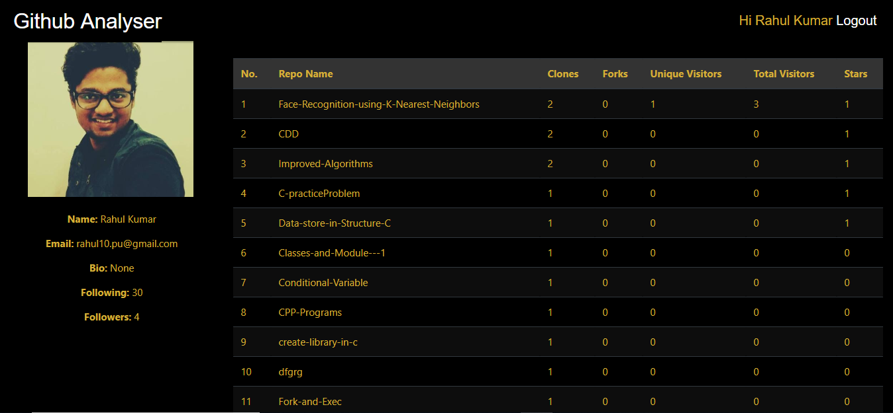
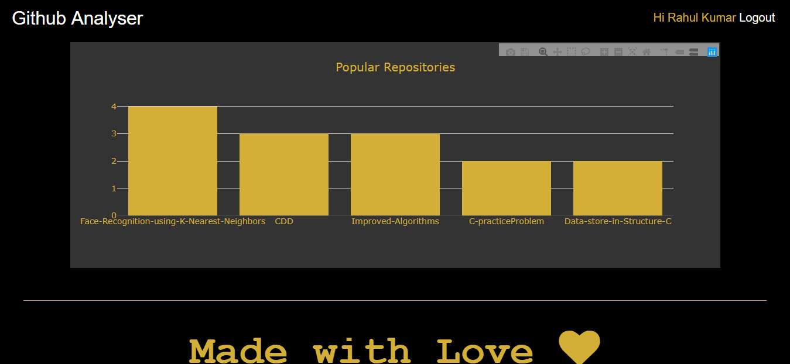

# Github Profile Analyzer Web-Application

* A tool that will help you to analyze your **Github Repositories**.You can check every important detail at one place on same page.The project is using threading to make it fast.

### What will our Web app do (Objectives) ?
* As the name suggests, it **analyses the User’s GitHub Profile.**
* After Analysing User’s Github profile, it gives important details about **user’s repositories such as how many forks, clones have been made on each repository.**
* Apart from that, it also shows how many people *(unique and total)* have visited the user’s repos.
* There is another feature which **allows the user to have a 2d graph representation of all the details in user’s repos.**

### Why do we need GitHub Profile Analyser ?
The Github Profile Analyser tells the User about the no. of people visiting on his repos which **helps him/her in recognizing the popularity of his repos.** This helps the user in deciding or setting up the priorities among the repos as the repos that are more popular, obviously requires a much needed attention. The **profile analyser also tells how many forks and clones have been made since the user has made the repo. This helps the user in understanding the need of the project among the developers.**

## Technology Stack
	HTML,CSS,Bootstrap,JS(Frontend)
	GitHub API connection.
	Python,Flask,Jinja2(Backend)

### Front-End Information

##### The front-end consists of 3 webpages:

* The first page is **Homepage** where the user needs to **Login using his Github username and password.**

### Home Page | Login Page :-

* The Second one is **Stats Page** where the user will be able to see the details **about his repos such as REPO NAME, CLONES, FORKS, UNIQUE VISITORS, TOTAL VISITORS and STARS.** In this page, the **User profile Pic** is also displayed in the left side **with his name, bio, following and followers.**

### Stats Page | Main Page :-

* The Third page is of **Graph Page** which has been produced using **PLOTLY**. Here a **2-D Graph** is generated which shows which repo is **more popular.**

### Graph Page :-

* The Final page is of **Error Page** which displayed in case Server Breaks, Internet Connection User, Unauthenticated Login, **Page Not Found Error**.

### Error-404  Page :-

### Instructions:

* The first page is usual login page which is made by using Bootstrap and additional CSS. It has two fields one is for **username** and another one is for **password**. Since **GitHub’s API** has been used, user can login only using **GitHub’s credentials**.

* As soon as user hit the **Submit button**,*entered data is send to GitHub API for verification. If entered data is incorrect, then user will get error message displaying “Error: Bad credentials”* else user will be redirected to the main home page.

* In the home page user can all his/her repositories in the form of a table. Table has many columns showing different information like repository name, total views, unique views, fork, clone etc. All this information is provided by using the GitHub’s API.
There is another additional feature of graph in this project. User can see information about its repositories in a 2D graph. This graph has been made in the Plotly.

### Workflow

* During login, the user has to enter his Github username and password. If username or password is not valid, then an error message will occur “Error: Bad Credentials”.

* If the user left the username and password textboxes empty and clicked on login, a message will be shown “Please fill out these fields”.
After logging in, the main web-application opens which is the Github profile Analyser. Here the user can see a table which tells all the important details about all the user’s repositories.

* On clicking graph button, the graph page is opened where 2d representation can be seen of all the repos against total visits etc.

* There are different options or tools which have been made available using PLOTLY. These tools include download plot as a PNG file, edit in chart studio, zoom, pan etc.

### GitHub API Connection:

* An API is basically a set of functions and procedures that allow the creation of applications which access the features or data of an operating system, application, or other service. To connect with Github API, we registered our web-application with auth0 in developer settings on github.com. Then github will provide us with client-id and client secret which we then copied on auth0 fields. Once we successfully authenticate a user, GitHub includes an Access Token in the user profile it returns to Auth0. This token is used to call their API. Github API is responsible for why we were able to analyse profiles from github user. Below is the code for a user which made this possible:

#### Designed With :heart: by  [@rahul10-pu](https://rahul10-pu.github.io/   "My PortFolio Link")
